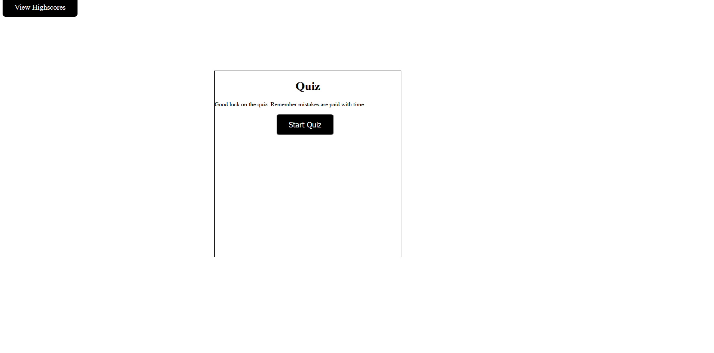
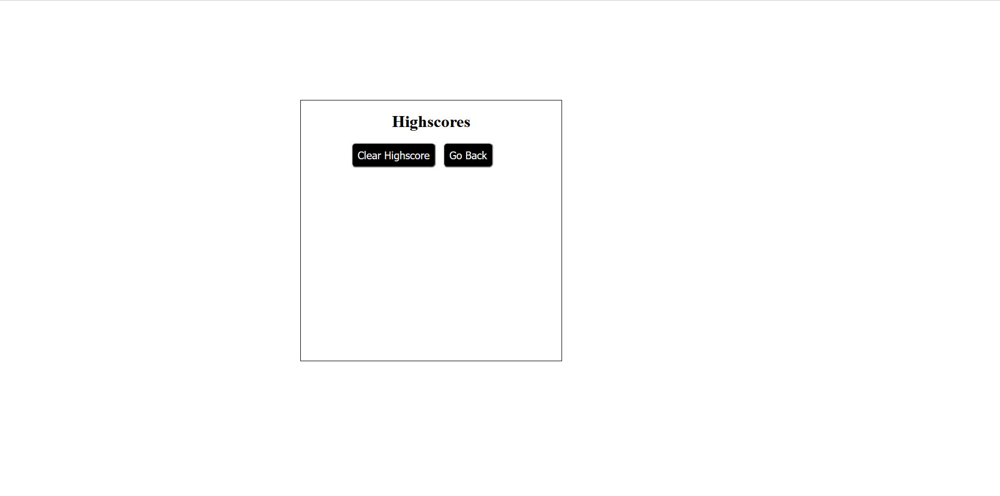

### Code Quiz
This is Challenge 4, making a code quiz
The idea behind this project was making a working Quiz with buttons and a timer also penalizing incorrect answer with time.
Also making a highscore feature with the ability to put in name and allowing it to also be reset.

### Link
https://spooncodes.github.io/JavaQuiz-Challenge4/

### Images

